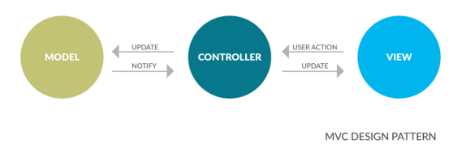
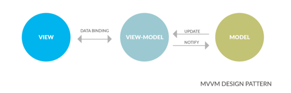
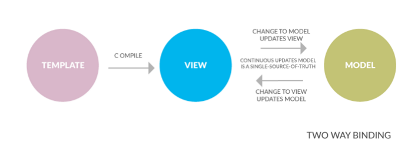
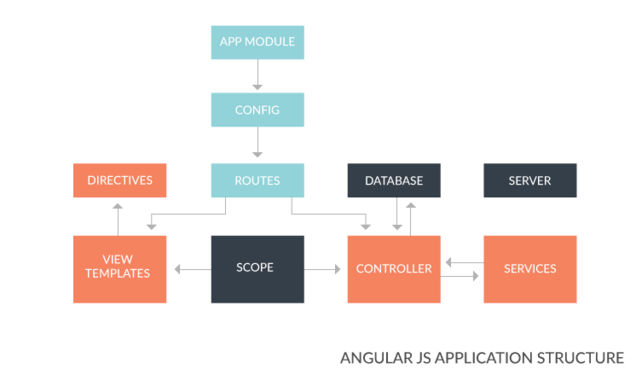
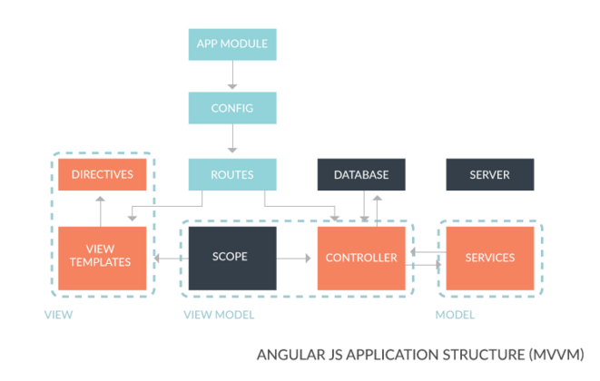

<h1>ANGULAR</h1>

<a href="https://skylabcoders.github.io/bootcamp-julio2017/?full#135">SLIDES ANGULAR</a>

```
Angular es un FRAMEWORK de Google que nos permite ahorrar trabajo y código y

modularizar una APP (controllers, services, directives, constants, filters, 

templates).

a partir de la versión 2 va con Typescript. No es muy bueno con SEO, así que 

las partes que nos interese indexar, hacerlas con PUG y las demás con ANGULAR
```


<h2>1. The MVC / MVVM Design Patterns</h2>

**MVC pattern**

. Separación limpia entre: view (UI), controller (intermediario) y modelo (data)

. Separación entre el manejo de datos y la presentación



**MVVM pattern**



**Dos Maneras de unir pattern (VM)**

    La vista es una proyección del modelo en todo momento

    VM en AngularJS ➡ $scope del objeto




<h2>2. Angular application structure</h2>

Una aplicación de **Angular** consiste en:

    . Controllers: entrelaza entre modelo (service) y view (template)

    . Templates: view

    . Directives: componentes UI  o custom tag atributos.

    . Services: recupera datos del servidor (dependencias a los controles)




**Angular application structure (MVVM)**



**Directory Structure**

```
project root/
        index.html      // entry point for our application
        javascript/
            app.js    // defines our application and configuration
            controller.js // our controllers
            directive.js  // our directives
            service.js    // our services
        templates/
            // our application views or html files
        css/
            // our css files
        vendor/
            // any external libraries we wish to use e.g. bootstrap
            // angular, jquery etc
```


**NG Controller** 

    Almacena y envía donde le digamos


-Tot estarà enmagatzemat en càpsules

**Presentation**      |    **Business**        |              **Data**
    archich view      |    spoty service       |         API Spotify
---->                 |    ----->              |           ---->      
templates, html       |                        |
(siempre seguirá esta dirección)|              |
----------------------------------------------------------------------
    artist view2      |                        |       


Siempre es de presentation a data, para tener + visibilidad
vista (html)          |     control            |      model


scope será nuestro model (trabaja con cosa que manejan la vista)
cuando diseñas una app, tienes que pensar cuantas vistas vas a tener


Ejemplo:

Funciones:
-Register
-Login
-Home
-Profile

En este ejemplo serían 4 vistas generales y cada sección tendría subvistas. Cada vista tendrá su scope. Un controller se encarga de un grupo funcional. Lo standar sería un controller para cada vista.
Sería como pensar en templates


API services funcionan con $http recipe
app.config ---> me permite configurar cosas
-----
ngRoute --- componente para rutear cosas. para ello debemos importar la libreria angular route y ponerla en un script
Ej:https://www.w3schools.com/angular/tryit.asp?filename=try_ng_routing


Directivas + usadas:
ng-if
ng-bind
ng-controller
ng-model
ng-app
ng-repeat        (solo itera sobre arrays)
ng-show
ng-hide
-ng-click

$http ----> para llamar a ajax!


**factory**

Las factories permiten construir servicios


para pasar http como servicio lo ponemos dentro de parametro de funcion


------
A module contains the different components of an AngularJS app
A controller manages the app's data
An expression displays values on the page   ---> {{ }}
A filter formats the value of an expression ---> {{ product.price | currency }}

----
**Filtros**
<p class="price">{{ product.price | currency }}
En este ejemplo, el | sirve para añadir un filtro
aquí seria 19 y €  (19€)

currency nos permite darle valor de moneda local (euro, dolar, libra...)


Date: para ponerlo con fecha actual y bien puesto
Uppercase: para letra mayúscula


------------
**Organizacion**
App:
dentro de app-->
1)Carpeta services --->spotyfyService (trabaja con la api, no maneja nada de la vista)
2)controllers---> a)artist controller b)album controller

En la carpeta general--->
1)index.html
2)main.js


----------------------------------------------------------------------------
///El ng route normalmente lo pasamos como parametro en una función y estará dentro de un array. Angular siempre requiere que le pasemos un array, aunque sea vacio. Cuando pasamos ng route lo podemos pasar acompañado de más cosas cosas en ese array (módulos)
https://www.w3schools.com/angular/angular_routing.asp

En el route provider, cuando queramos que recorra una zona lo pondremos en orden de jerarquia. Primero el main y luego las siguientes páginas. Ej:

<body ng-app="myApp">

<p><a href="#/!">Main</a></p>

<a href="#!red">Red</a>
<a href="#!green">Green</a>
<a href="#!blue">Blue</a>

<div ng-view></div>

<script>
var app = angular.module("myApp", ["ngRoute"]);
app.config(function($routeProvider) {
    $routeProvider
    //solo será "/" porque es la raiz
    .when("/", {
        templateUrl : "main.htm"
    })
    // es "/red" porque es la siguiente sección después de la raíz (/main/red), y así constantemente
    .when("/red", {
        templateUrl : "red.htm"
    })
    .when("/green", {
        templateUrl : "green.htm"
    })
    .when("/blue", {
        templateUrl : "blue.htm"
    });
});
</script>
</body>


-------------------------------
**ng-include**
Para incluir html de archivos externos
https://www.w3schools.com/angular/ng_ng-include.asp


**otherwise**
En caso de que no encuentre la ruta que vaya ahí


