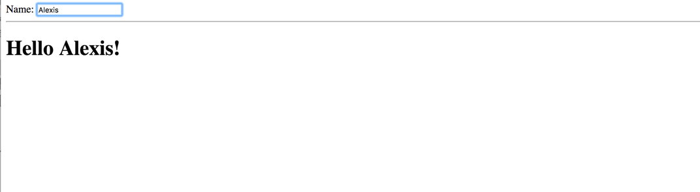

<h1>Exercise 2 - APLICATION MODULE</h1>

. Hacer un input y que mediante data binding nos muestre el nombre que pongamos.

. Para ello usaremos un módulo dentro de el archivo app.js

. Le daremos al módulo de nombre **mainApp**

